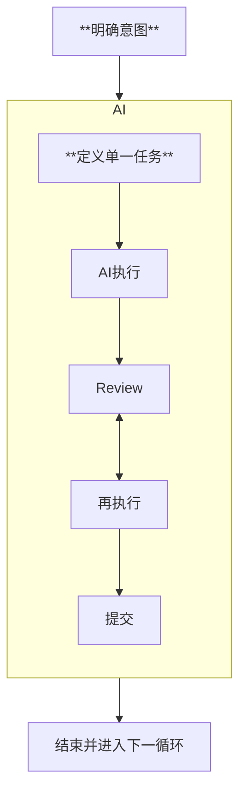

# 编码流程 Skills

编码流程是整个skills的核心

整个这套脚手架就是依赖 `人类意图->编码流程->结束->人类意图...` 这个无限循环执行的

该skills是将 **Human-in-the-Loop (HITL)** 规范为可执行的具体流程:

##### **明确意图** → **定义单一任务** → AI执行 → Review ↔ 再执行 → 提交

---

#### 具体流程如下:

0. 归档上次的plan, 保证每次循环可追溯, 重放或恢复

1. 轻量规划, 决定是否进入plan流程 [flow-gate]
   - if true: [coding-workflow] skills
   - else: return
2. 分析人类意图, 对齐 [intent-align]
   - 可以理解为技术返述
3. 规划 [planning]
   - 观察与参考现有代码/文档
   - 我要做什么, 需要哪些步骤
   - 规划(spec)
     - markdown与mermaid
4. [precoding-todo]
5. 执行(编码) [execute-coding]
   - human-in-loop: 遇到高风险, 或需要偏离 plan 则阻断并确认
6. (Optional)测试代码:
   - 为什么是Optional: 不同 技术栈/项目阶段 的项目对单测的需求程度不同, 根据需要添加测试代码步骤, 以免造成无必要的心智负担
   - 单测是可以后期补全的, vibe coding项目迭代快, 测试代码生成成本低廉
7. (Optional)执行测试代码
9. AI review(确认是否符合代码规范, 开发习惯)
10. --- 人类介入 ---
11. hunman review
12. commit流程, 人类触发: "提代码"
    1.  二次 ToDo 规划整理
       - 是否引入隐患或有待完成项需要记录?
       - 是否有已完成项需要标记
    2.  (TODO)沉淀开发日志?
    3.  (TODO)自总结更新 **项目skills**
    4.  commit[commit]
