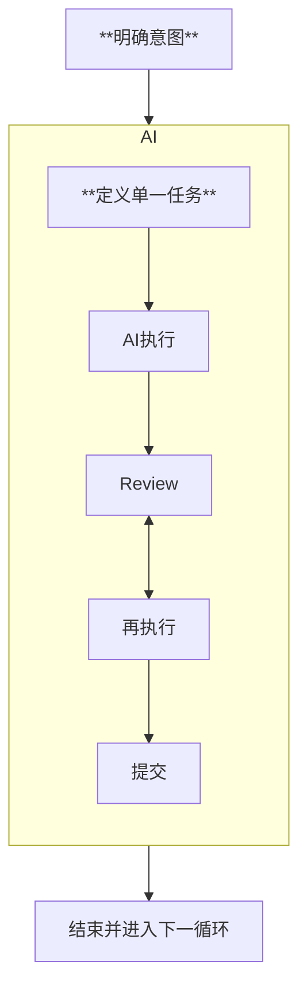

# 编码流程 Skills

编码流程是整个skills的核心

整个这套脚手架就是依赖 `人类意图->编码流程->结束->人类意图...` 这个无限循环执行的

该skills是将 **Human-in-the-Loop (HITL)** 规范为可执行的具体流程:

##### **明确意图** → **定义单一任务** → AI执行 → Review ↔ 再执行 → 提交

---

#### 具体流程如下:

0. 归档上次的plan, 保证每次循环可追溯, 重放或恢复
1. 轻量规划, 决定是否进入plan流程 [flow-gate](../../.agents/skills/common/flow/flow-gate/SKILL.md)
   - if true: [coding-workflow](../../.agents/skills/common/flow/coding-workflow/SKILL.md) skills
   - else: return
2. 分析人类意图, 对齐 [intent-align](../../.agents/skills/common/flow/intent-align/SKILL.md)
   - 可以理解为技术返述
3. 规划 [planning](../../.agents/skills/common/flow/planning/SKILL.md)
   - 观察与参考现有代码/文档
   - 我要做什么, 需要哪些步骤
   - 规划(spec)
     - markdown与mermaid
4. [precoding-todo](../../.agents/skills/common/operation/precoding-todo/SKILL.md)
   - 编码前根据plan进行一次todo记录
5. 执行(编码) [execute-coding](../../.agents/skills/common/flow/execute-coding/SKILL.md)
   - human-in-loop: 遇到高风险, 或需要偏离 plan 则阻断并确认
6. (Optional)测试代码:
   - 为什么是Optional: 不同 技术栈/项目阶段 的项目对单测的需求程度不同, 根据需要添加测试代码步骤, 以免造成无必要的心智负担
   - 单测是可以后期补全的, vibe coding项目迭代快, 测试代码生成成本低廉
7. (Optional)执行测试代码
8. [ai-review](../../.agents/skills/common/operation/ai-review/SKILL.md), 确认:
   1. 已完成需求
   2. 符合代码规范, 无风险点等
9. --- 人类介入 ---
10. hunman review
11. commit流程, 人类触发: "提代码" [commit](../../.agents/skills/common/operation/commit/SKILL.md)
    1. 二次 ToDo 规划整理 [postcoding-todo](../../.agents/skills/common/operation/postcoding-todo/SKILL.md)
       - 是否引入隐患或有待完成项需要记录?
       - 是否有已完成项需要标记
    2. (TODO)沉淀开发日志?
    3. (TODO)自总结更新 **项目skills**
    4. 原子化commit
